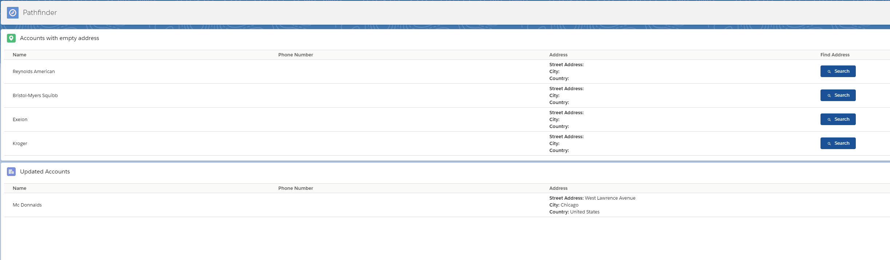


<p align="center"><strong>PATHFINDER</strong></p>
<p align="center">
  <a aria-label="LWC - Documentation" href="https://lwc.dev/guide/introduction">
    </img>
  </a>
</p>

## About
Pathfinder is a Salesforce APP created for the New10 challenge.

As requested:
```
User wants to view 2 sections on the page :
               * one which displays the last 10 accounts without the address fields filled. (City || Street || Country is empty)
               * one which displays the last 30 accounts which were last modified and have the address fields fully filled
 
The user wants to view the fields : Name, PhoneNumber, Address. 
 
The user wants to be able to retrieve the address based on the account name by pressing a button on the same row the account record without a full address is displayed. The moment the full address is filled the section should display the next accounts without an address filled. And the 2nd section should display the Account which was newly updated with the full address.
 
If no address could be retrieved the user would like to see a toast message which informs them that no address was found and the account should not be displayed anymore in the table.
```
<p align="center"></img></p>

## Design Pattern:
**Apex Enterprise Patterns: Domain & Selector Layers**

**Apex Enterprise Patterns: Service Layer**


## Libraries:

FFLIB


**The project consists of:**

**LWC**:
```
new10Challenge.html
new10Challenge.js
new10Challenge.js-meta
```
new10Challenge.js functions:

	-Has two wired functions (wiredCallbackAccountsWithEmptyAddress and wiredCallbackLastUpdatedAccounts) that will fetch data from Apex controller (PathfinderController);
	-handleClick(): handles de click event of the search address button. This functions stores the Account.Id and Account.Name and send them to the findPlaceFromTextCallout function.
	-findPlaceFromTextCallout: This function will make an Api Request to the Google Places API using the "Find Place From Text" method (Request made from the apex class PathfinderPlaceRequest.sendRequest). Sadly, it returns just a string of the address and pattern varies from country to country. Because i needed to identify the City, the Street and the Country, i had to send this address as a parameter to another Google Api, the Geocode Api.
	-geocodingCallout: With the Address JSON returned from the findPlaceFromTextCallout, i used the string to request the Geocode API to send me a JSON with all the data that i need from that Address.
	-updateAccout: Function used to update the account record through the Lightning Data Service function updateRecord.
	-updateAccountAddressNotfound: Same as previous but handles accounts that the API couldn't find the Address.
	-throwErrorToast: Function to throw an error Toast.
	-throwInfoToast: Function to throw an info Toast.
	-clearValues: Function used to clear values from context variables.

**JSON**: 

Find Place From Text:
```json
{
  "candidates": [
    {
      "formatted_address": "Mr.Treublaan 7, 1097 DP Amsterdam, Países Baixos"
    }
  ],
  "status": "OK"
}
```

Geocode:

```json
{
  "results": [
    {
      "address_components": [
        {
          "long_name": "7",
          "short_name": "7",
          "types": [
            "street_number"
          ]
        },
        {
          "long_name": "Mr.Treublaan",
          "short_name": "Mr.Treublaan",
          "types": [
            "route"
          ]
        },
        {
          "long_name": "Amsterdam-Oost",
          "short_name": "Amsterdam-Oost",
          "types": [
            "political",
            "sublocality",
            "sublocality_level_1"
          ]
        },
        {
          "long_name": "Amsterdam",
          "short_name": "Amsterdam",
          "types": [
            "locality",
            "political"
          ]
        },
        {
          "long_name": "Amsterdam",
          "short_name": "Amsterdam",
          "types": [
            "administrative_area_level_2",
            "political"
          ]
        },
        {
          "long_name": "Noord-Holland",
          "short_name": "NH",
          "types": [
            "administrative_area_level_1",
            "political"
          ]
        },
        {
          "long_name": "Netherlands",
          "short_name": "NL",
          "types": [
            "country",
            "political"
          ]
        },
        {
          "long_name": "1097 DP",
          "short_name": "1097 DP",
          "types": [
            "postal_code"
          ]
        }
      ],
      "formatted_address": "Mr.Treublaan 7, 1097 DP Amsterdam, Netherlands",
      "geometry": {
        "bounds": {
          "northeast": {
            "lat": 52.3487343,
            "lng": 4.915670299999999
          },
          "southwest": {
            "lat": 52.3478832,
            "lng": 4.9143427
          }
        },
        "location": {
          "lat": 52.348441,
          "lng": 4.9146469
        },
        "location_type": "ROOFTOP",
        "viewport": {
          "northeast": {
            "lat": 52.3496577302915,
            "lng": 4.916355480291502
          },
          "southwest": {
            "lat": 52.3469597697085,
            "lng": 4.913657519708497
          }
        }
      },
      "partial_match": true,
      "place_id": "ChIJDQEYooEJxkcRQy9zohEt7HY",
      "types": [
        "premise"
      ]
    }
  ],
  "status": "OK"
}
``` 


**Apex Classes**:
```
MockTestData: Mock class used to generate data for teste class.
PathfinderController: Class used to call the Selector Layer and return both lists(Account without address and updated accounts) to the frontend.
AccountsSelector: Uses selectAccountsWithEmptyAddress and selectLastUpdatedAccounts to dynamically query the Account Object using fflib.
PathfinderControllerTest: controller teste class (100% coverage).
PathfinderPlaceRequest: Class with two methods. sendRequest (receives account name as parameter) and make the request to the Google Places API. sendRequestGeocoding (receives and address as parameter) and make the request to the Geocode API.
PathfinderPlaceRequestTest: Callout test class. Has two mock classes and test both methods from PathfinderPlaceRequest (100% coverage).
```
